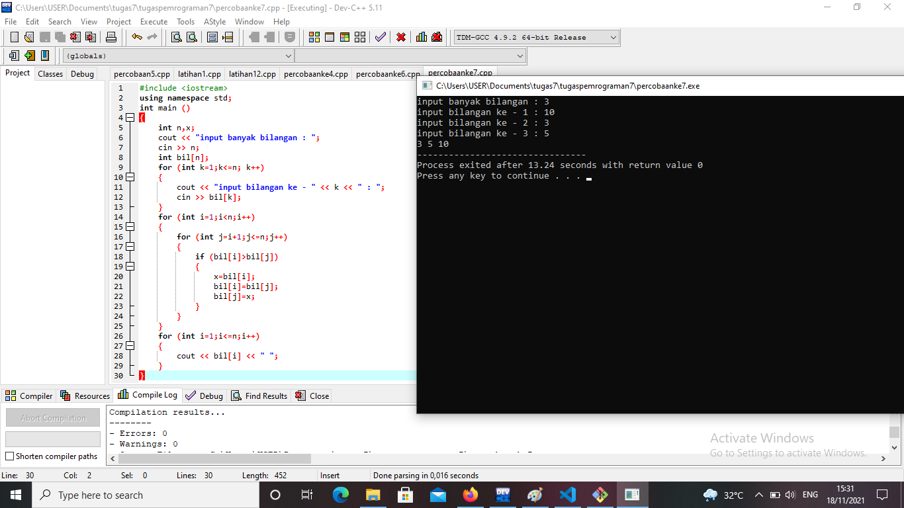

# tugaspemrograman7
## NAMA : AMAD SUMADI NIM    : 312110525 KELAS  : TI.21.CA1 PRODI  : TEKNIK INFORMATIKA 
### LATIHAN 1 PERULANGAN 2
berikut adalah langkah langkah mengerjakan latihan 1 perulangan 2

dan ini adalah hasil dari program tersebut

#### LATIHAN 2 PERULANGAN 2
berikut adalah langkah langkah membuat program mengurutkan bilangan pada latihan 2

dan dibawah ini adalah hasil dari langkah langkah tersebut

##### LATIHAN 1 PERULANGAN 3
berikut ini adalah langkah langkah dari latihan 1.

adapun hasilnya nanti akan muncul gambar seperti di bawah ini kemudian setelah mungkin gambar tersbut lalu masukkan angka sesuka anda.
 
###### LATIHAN 2 PERULANGAN 3
berikut ini adalah langkah langkah dari latia 2 perulangan 2

dan ini adalah hasil dari program tersebut
